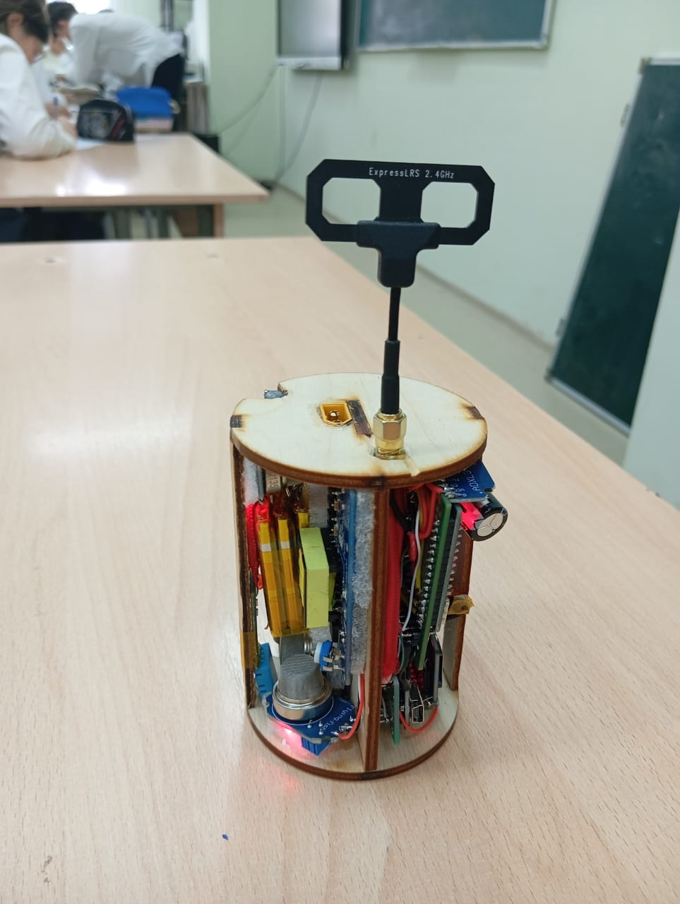
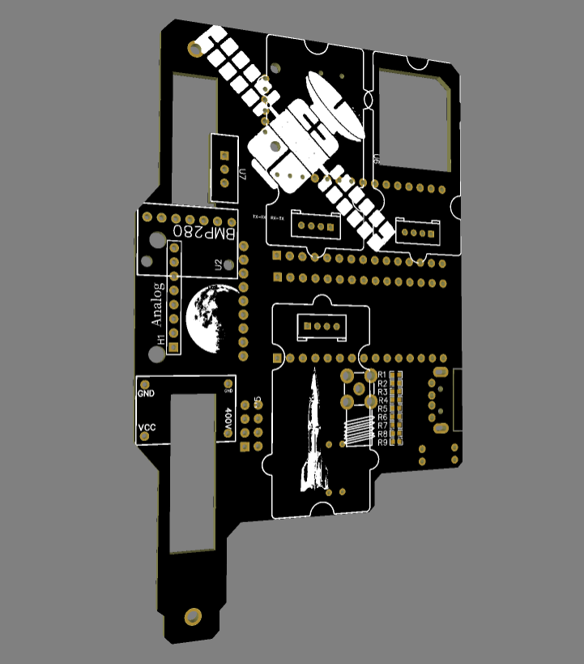

# Rocket CanSat 2025

Модульная система телеметрии и экологического мониторинга для учебных ракет и прототипов CanSat/CubeSat. В репозитории сохранена полная история разработки V1: бортовые прошивки, наземный приёмник, тестовые скетчи, схемы, логи и презентационные материалы.

  
  

  <a href="README.md">English version</a> ·
  <a href="https://www.youtube.com/watch?v=PDBPk4lwok4">Видео запуска</a> ·
  <a href="V-1.x/V-1.2/cansat_v1.2_master/cansat_v1.2_master.ino">Master V1.2</a> ·
  <a href="V-1.x/V-1.2/cansat_v1.2_slave/cansat_v1.2_slave.ino">Логгер V1.2</a>

## Достижение

Ранняя версия этой системы заняла **2-е место на Eurasian Rocketry Challenge 2023**, проходившем в Satbayev University, Казахстан.

## Обзор системы

| Подсистема | Реализация V1 |
| --- | --- |
| Главный контроллер | Arduino-совместимый master-контроллер |
| Измерение движения | Акселерометр и гироскоп MPU6050 |
| Атмосфера | BMP280: температура, давление и барометрическая высота |
| Эксперименты с газами | MQ-2, MQ-8 и MQ-135 |
| Радиотелеметрия | nRF24L01, 2,4 ГГц |
| Логирование | Второй контроллер с записью на microSD |
| Видео | Независимый аналоговый FPV-канал 5,8 ГГц |

### Путь данных

1. **Master** считывает инерциальные, барометрические и газовые датчики.
2. Он передаёт структуру телеметрии по nRF24 и одновременно отправляет эти данные второму контроллеру по последовательному каналу.
3. **Slave/логгер** записывает принятые измерения в `datalog.txt` на карте microSD.
4. **Наземный приёмник** выводит радиотелеметрию в Serial Monitor.

В прошивке V1.2 объединены BMP280, MPU6050, MQ-2, MQ-8, MQ-135, nRF24 и логирование на microSD. В дополнительных папках сохранены эксперименты со счётчиком излучения, DHT11 и отдельными этапами связи — это тесты разработки, а не единый полностью интегрированный релиз.

## Версии

| Версия | Master | Логгер / slave | Наземный приёмник |
| --- | --- | --- | --- |
| V1.0 | [Открыть](V-1.x/V-1.0/cansat_v1.0_master/cansat_v1.0_master.ino) | [Открыть](V-1.x/V-1.0/cansat_v1.0_slave/cansat_v1.0_slave.ino) | — |
| V1.1 | [Открыть](V-1.x/V-1.1/cansat_v1.1_master/cansat_v1.1_master.ino) | [Открыть](V-1.x/V-1.1/cansat_v1.1_slave/cansat_v1.1_slave.ino) | [Открыть](V-1.x/V-1.1/receiver/receiver.ino) |
| V1.2 | [Открыть](V-1.x/V-1.2/cansat_v1.2_master/cansat_v1.2_master.ino) | [Открыть](V-1.x/V-1.2/cansat_v1.2_slave/cansat_v1.2_slave.ino) | Использует совместимую концепцию приёмника V1 |

## Документация и медиа

- [Полная схема подключения](docs/wiring/V-1/wiring.PNG)
- [Схема платы](docs/wiring/V-1/pcb-board.PNG)
- [Пример лога телеметрии](docs/logs/DATALOG.txt)
- [Презентация проекта — PDF](docs/showcase/Cansat.pdf)
- [Презентация проекта — PowerPoint](docs/showcase/Cansat.pptx)
- [Архивное демонстрационное видео](docs/showcase/WhatsApp%20Video%202024-09-27%20at%2011.02.48.mp4)
- [Рендеры плат](images/V-1/pcb-renders)
- [Фотографии прототипа](images/V-1/real-photos)
- [Видео запуска на YouTube](https://www.youtube.com/watch?v=PDBPk4lwok4)

## Структура репозитория

| Путь | Содержимое |
| --- | --- |
| [`V-1.x/V-1.0`](V-1.x/V-1.0) | Первый интегрированный прототип |
| [`V-1.x/V-1.1`](V-1.x/V-1.1) | Обновлённые датчики, логирование и наземный приёмник |
| [`V-1.x/V-1.2`](V-1.x/V-1.2) | Последняя архивная интегрированная прошивка |
| [`V-1.x/test`](V-1.x/test) | Тесты компонентов, связи и детектора излучения |
| [`docs`](docs) | Схемы, логи и демонстрационные материалы |
| [`images`](images) | Рендеры плат и фотографии |

## Требования для сборки

Интегрированные скетчи рассчитаны на Arduino IDE и используют:

- `Adafruit_BMP280`
- `RF24` / `nRF24L01`
- `TroykaMQ`
- `basicMPU6050`
- `SD`, `SPI`, `Wire` и `SoftwareSerial`

Перед компиляцией выберите скетч, соответствующий аппаратной версии, и проверьте назначение выводов. Показания датчиков MQ сильно зависят от калибровки и условий работы, поэтому их следует считать экспериментальными.

Данные доступа в архивном тесте Wi‑Fi/API заменены безопасными шаблонами `YOUR_...`. Настоящие пароли и ключи нельзя хранить в Git.

## Автор и использование

Разработал и поддерживает проект **Владимир Чаплий**. Контакт: `v.chapliy.dev@gmail.com`.

Код и материалы опубликованы для портфолио и образовательного ознакомления. Открытая лицензия не предоставляется: перед существенным повторным использованием свяжитесь с автором и при получении разрешения обязательно укажите авторство.
